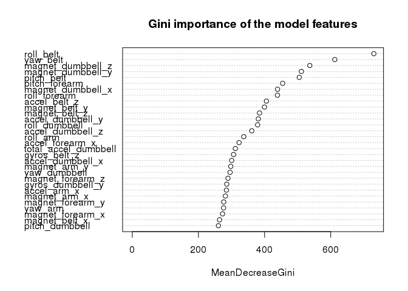
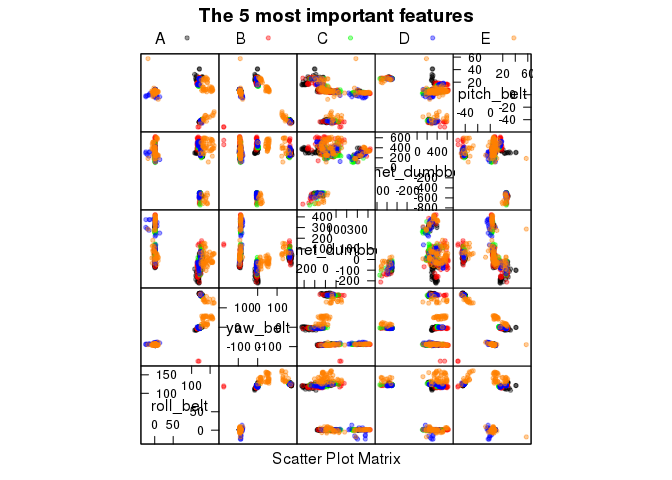

# Human Activity Recognition

*Report generated 31 January, 2016 01:41*

## Problem description

This is my solution to the assignment of [Coursera's Practical Machine
Learning](https://www.coursera.org/learn/practical-machine-learning/)
which is based on the study
[Human Activity Recognition](http://groupware.les.inf.puc-rio.br/har).

From the study web site:

> Six young health participants were asked to perform one set of 10 repetitions
> of the Unilateral Dumbbell Biceps Curl in five different fashions: exactly
> according to the specification (Class A), throwing the elbows to the front
> (Class B), lifting the dumbbell only halfway (Class C), lowering the dumbbell
> only halfway (Class D) and throwing the hips to the front (Class E).

Here is a video showing the exercise analyzed in this study:
[D B UNILATERAL CURLS](https://www.youtube.com/watch?v=YxtwA7XRK_g).

Refer to the study
[paper](http://groupware.les.inf.puc-rio.br/public/papers/2013.Velloso.QAR-WLE.pdf) for details:
Velloso, E.; Bulling, A.; Gellersen, H.; Ugulino, W.; Fuks, H. Qualitative
Activity Recognition of Weight Lifting Exercises. Proceedings of 4th
International Conference in Cooperation with SIGCHI (Augmented Human '13) .
Stuttgart, Germany: ACM SIGCHI, 2013.

The objective of the assignment is to propose a model, train it with the
provided training data set and predict the exercise class using the provided
testing set as input.

## Recorded data

From the study paper:

> For data recording we used four 9 degrees of freedom Razor
> inertial measurement units (IMU), which provide three-axes
> acceleration, gyroscope and magnetometer data at a joint
> sampling rate of 45 Hz.

The device could be similar to this
[Razor IMU](https://www.sparkfun.com/products/10736)
from SparkFun Electronics, which measures
9 degrees of Freedom on a single, flat board:
- [ITG-3200](https://cdn.sparkfun.com/datasheets/Sensors/Gyros/3-Axis/EB-ITG-3200-00-01.1.pdf)
  triple-axis digital-output gyroscope
- [ADXL345](http://www.sparkfun.com/datasheets/Sensors/Accelerometer/ADXL345.pdf)
  13-bit resolution, ±16g, triple-axis accelerometer
- [HMC5883L](http://cdn.sparkfun.com/datasheets/Sensors/Magneto/HMC5883L-FDS.pdf)
  triple-axis, digital magnetometer (Digital Compass)


> For feature extraction we used a sliding window approach
> with different lengths from 0.5 second to 2.5 seconds, with
> 0.5 second overlap. In each step of the sliding window
> apprproach we calculated features on the 
> [Euler angles](https://en.wikipedia.org/wiki/Euler_angles#Alternative_names) 
> (roll, pitch
> and yaw), as well as the raw accelerometer, gyroscope and
> magnetometer readings. For the Euler angles of each of the
> four sensors we calculated eight features: mean, variance,
> standard deviation, max, min, amplitude,
> [kurtosis](https://en.wikipedia.org/wiki/Kurtosis) and
> [skewness](https://en.wikipedia.org/wiki/Skewness),
> generating in total 96 derived feature sets.


## Feature naming

The naming convention used for variables containing IMU measurement in the data
sets can be expressed informally as follows:
`stat_(roll|yaw|pitch|accel|gyros|magnet)_(belt|arm|forearm|dumbbell)_(x|y|z)`
where `stat` is an statistic (`var`, `max`,`min`,`avg`, `kurtosis`, `skewness`,
etc.) present always for Euler angles and sometimes for `accel` and `magnet`,
and `x|y|z` is the coordinate name, which is  not present for Euler angles. The
`(belt|arm|forearm|dumbbell)` part refers to the location of each of the 4
IMUs.

## Loading and preprocessing the data

Load required libraries.


```r
library(caret,quietly=TRUE)
# to print the model correctly on the fist call to print()
library(randomForest,quietly=TRUE)
```

Load provided training and testing data, converting all strings to appropriate
numeric types where possible. Treat empty strings and strings equal to `NA` or
`#DIV/0!` as NA's.


```r
training <- read.csv('pml-training.csv', stringsAsFactors=FALSE,
                     na.string=c('NA', '#DIV/0!'))
training$classe <- factor(training$classe)
testing <- read.csv('pml-testing.csv', stringsAsFactors=FALSE,
                     na.string=c('NA', '#DIV/0!'))
dimTrain <- dim(training)
dimTest <- dim(testing)
```

There are 19622 observations of 160 variables in the
training set. The testing set contains 20 observations.

The training and testing sets have the same columns, except for the last
one:


```r
namesDiff <- (names(testing)!=names(training))
names(testing)[namesDiff]; names(training)[namesDiff]
```

```
## [1] "problem_id"
```

```
## [1] "classe"
```

The last column of the training set is `classe`, the variable we are trying to
predict. The last column of the testing set is a dummy called `problem_id`.

## Feature selection

In the paper of the study, the authors based their feature selection in a
correlation analysis (see
[Hall](http://www.cs.waikato.ac.nz/~mhall/thesis.pdf)). Most of the features
selected by the authors are not available in our testing set (specifically,
derived features by taking some statistic on the measurements such as mean,
variance, maximum or minimum).

So in my model I choose simply to use any feature in the training set that is
available in the testing set, i.e. any feature for which not all observations
in the testing set are NA's.

I am cheating a bit because I am investigating the testing set, however not to
inspect the *values* of the variables, but just to see what variables are
available to predict (i.e. which feature columns don't consist of just NA's)


```r
n <- names(training)
allnas <- sapply(testing, function(c) all(is.na(c)))
feat <- n[!allnas]
```

From these features, let's filter out the first seven ones (which contain
miscellaneous information such as user name and timestamp that are in principle
irrelevant to the prediction) and the last one, the dummy `problem_id`.


```r
feat <- feat[-c(1:7,length(feat))]
feat
```

```
##  [1] "roll_belt"            "pitch_belt"           "yaw_belt"            
##  [4] "total_accel_belt"     "gyros_belt_x"         "gyros_belt_y"        
##  [7] "gyros_belt_z"         "accel_belt_x"         "accel_belt_y"        
## [10] "accel_belt_z"         "magnet_belt_x"        "magnet_belt_y"       
## [13] "magnet_belt_z"        "roll_arm"             "pitch_arm"           
## [16] "yaw_arm"              "total_accel_arm"      "gyros_arm_x"         
## [19] "gyros_arm_y"          "gyros_arm_z"          "accel_arm_x"         
## [22] "accel_arm_y"          "accel_arm_z"          "magnet_arm_x"        
## [25] "magnet_arm_y"         "magnet_arm_z"         "roll_dumbbell"       
## [28] "pitch_dumbbell"       "yaw_dumbbell"         "total_accel_dumbbell"
## [31] "gyros_dumbbell_x"     "gyros_dumbbell_y"     "gyros_dumbbell_z"    
## [34] "accel_dumbbell_x"     "accel_dumbbell_y"     "accel_dumbbell_z"    
## [37] "magnet_dumbbell_x"    "magnet_dumbbell_y"    "magnet_dumbbell_z"   
## [40] "roll_forearm"         "pitch_forearm"        "yaw_forearm"         
## [43] "total_accel_forearm"  "gyros_forearm_x"      "gyros_forearm_y"     
## [46] "gyros_forearm_z"      "accel_forearm_x"      "accel_forearm_y"     
## [49] "accel_forearm_z"      "magnet_forearm_x"     "magnet_forearm_y"    
## [52] "magnet_forearm_z"
```

## Constructing a Random Forest model

I chose a random forest model because the random forest algorithm leads
frequently to a model with high prediction accuracy and has a low setup burden.
Not all are advantages, however. Random forests are slow to fit and difficult
to interpret.

Build the formula used for the model. We want to predict `classe` using all the
features selected above.


```r
fml <- paste0('classe ~ ', paste0(feat, collapse=' + '), collapse='')
fml <- as.formula(fml)
```

Let's try to fit the model using the default configuration (i.e. we do not
change the `trControl` argument of the `train` function). The default uses 25
[bootstraped](https://en.wikipedia.org/wiki/Bootstrapping_%28statistics%29)
resampling iterations. Fitting the random forest model takes
various hours. I let this run overnight.

```
modFit <- train(fml,method="rf",data=training)
```

As a future improvement, to speed up the  processing time of the `train()`
function, we could use the `parallel` package, which is supported by caret. A
fellow course student has written a great [guide](
https://github.com/lgreski/datasciencectacontent/blob/master/markdown/pml-randomForestPerformance.md).

Save the model in a format that permits us to reload it quickly, without the
need to fit it again:

```
saveRDS(modFit, file='modFit-rf.rds')
```

We can read the model back with:

```r
modFit <- readRDS('modFit-rf.rds')
```

The results achieved with this default configuration are quite impressive:


```r
print(modFit$finalModel)
```

```
## 
## Call:
##  randomForest(x = x, y = y, mtry = param$mtry) 
##                Type of random forest: classification
##                      Number of trees: 500
## No. of variables tried at each split: 2
## 
##         OOB estimate of  error rate: 0.44%
## Confusion matrix:
##      A    B    C    D    E  class.error
## A 5579    1    0    0    0 0.0001792115
## B   12 3782    3    0    0 0.0039504872
## C    0   18 3402    2    0 0.0058445354
## D    0    0   41 3173    2 0.0133706468
## E    0    0    0    7 3600 0.0019406709
```

Please refer to the [randomForest package
documentation](http://cran.r-project.org/web/packages/randomForest/randomForest.pdf)
for a description of the final model parameters.

The [out-of-bag](http://www.stat.berkeley.edu/~breiman/RandomForests/cc_home.htm#ooberr) estimate of the error rate is 0.44%,
which means that we expect that we can predict the 20 test cases correctly with a probability of


```r
((100-0.44)/100)^20
```

```
## [1] 0.9155831
```

In the fitting process 500 trees (`ntrees` parameter)
were created and combined to obtain the final model. In each tree,
2 variables (`mtry` parameter) were randomly sampled as
candidates at each split.

## Making predictions


```r
predTest <- predict(modFit, newdata=testing)
predTest
```

```
##  [1] B A B A A E D B A A B C B A E E A B B B
## Levels: A B C D E
```

This solution passes all the 20 test cases of the Course Project Prediction
Quiz.

## Model analysis

The 20 most [important
variables](http://www.stat.berkeley.edu/~breiman/RandomForests/cc_home.htm#varimp)
of the model are:


```r
varImp(modFit)
```

```
## rf variable importance
## 
##   only 20 most important variables shown (out of 52)
## 
##                      Overall
## roll_belt             100.00
## yaw_belt               80.54
## magnet_dumbbell_z      68.09
## magnet_dumbbell_y      63.90
## pitch_belt             62.84
## pitch_forearm          54.57
## magnet_dumbbell_x      52.01
## roll_forearm           51.94
## accel_belt_z           46.48
## magnet_belt_y          45.52
## magnet_belt_z          43.05
## accel_dumbbell_y       42.43
## roll_dumbbell          42.09
## accel_dumbbell_z       39.20
## roll_arm               35.18
## accel_forearm_x        32.85
## total_accel_dumbbell   31.01
## gyros_belt_z           30.12
## accel_dumbbell_x       29.19
## magnet_arm_y           28.74
```

The [Gini
importance](http://www.stat.berkeley.edu/~breiman/RandomForests/cc_home.htm#giniimp)
gives an identical order:


```r
gi <- data.frame(modFit$finalModel$importance)
s.gi <- sort(gi$MeanDecreaseGini, decreasing=T, index.return=T)
vi <- varImp(modFit)$importance
s.vi <- sort(vi$Overall, decreasing=T, index.return=T)
all(rownames(vi)[s.vi$ix] == rownames(gi)[s.gi$ix])
```

```
## [1] TRUE
```

Here is a plot of the features, sorted by their importance:


```r
varImpPlot(modFit$finalModel, main='Gini importance of the model features')
```

\

Here is a scatter matrix plot of the 5 most important features of the model:


```r
feat.sorted <- rownames(gi)[s.gi$ix]
inSample <- createDataPartition(y=training$classe, p=0.03, list=FALSE)
sample <- training[inSample,] # plot only a small sample of the training set
myColors<- c("black", "red", "green", "blue", "#ff7f00", "#458b00",
             "#008b8b", "#0000ff", "#ffff00")
mySymbol <- list(alpha=rep(.4, 9), col=myColors, cex=rep(0.8, 9),
                 fill=myColors, font=rep(1, 9), pch=20)
featurePlot(x=sample[,feat.sorted[1:5]], y=sample$classe, plot="pairs",
            auto.key=list(columns=5),
            par.settings=list(superpose.symbol=mySymbol),
            main='The 5 most important features')
```

\

(Credit: [r - How to label more that 7 classes with featurePlot? - Stack
Overflow](https://stackoverflow.com/questions/29715358/how-to-label-more-that-7-classes-with-featureplot)).

This could be a starting point to guess pairwise relations between two features
that lead to a certain case of the prediction. For example, class A
observations (black points) seem to fall in a couple of spots with specific
values of the `roll_belt` and `pitch_belt` variables.
